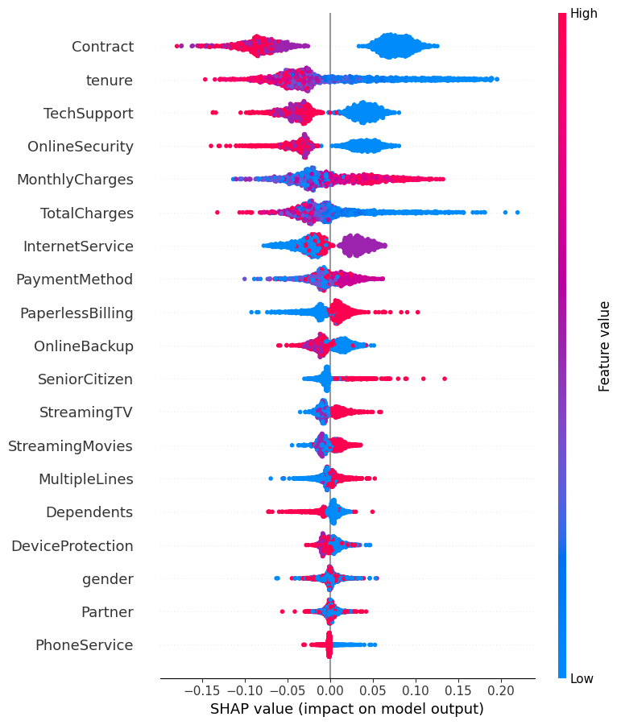
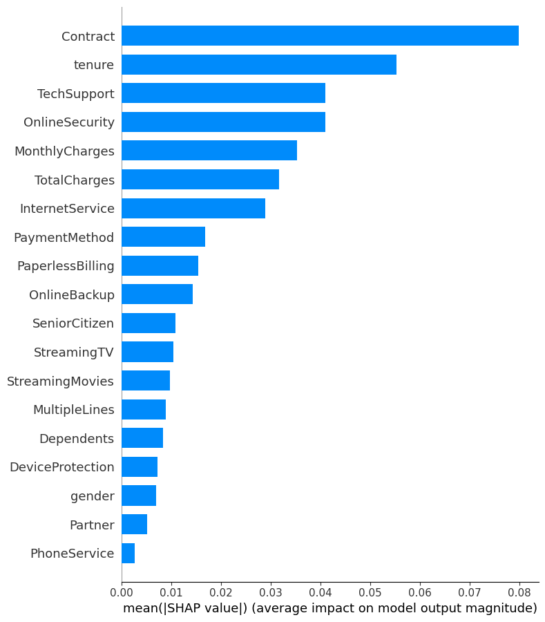
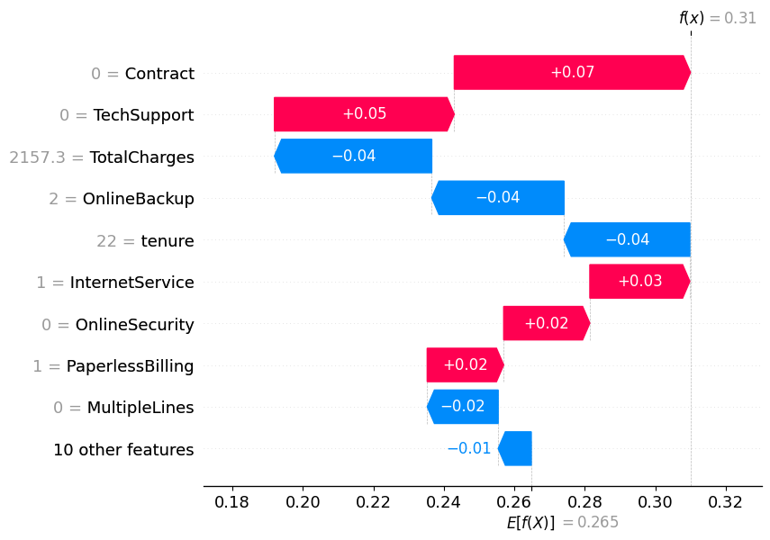
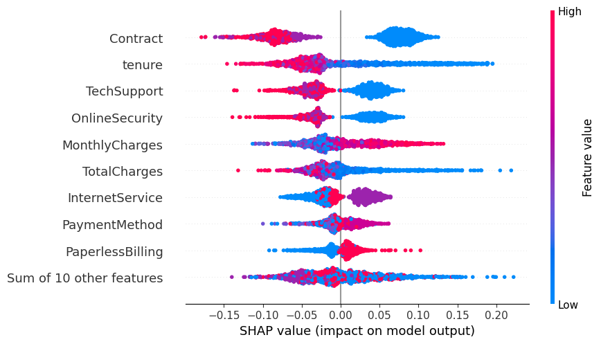
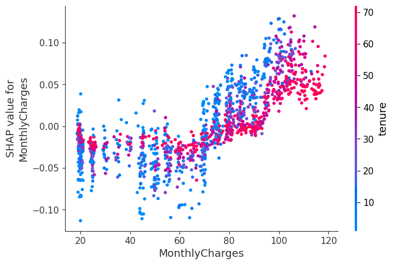

# Explainable AI (XAI) Report: Customer Churn Prediction

**Authors**: Ganesh Reddy, Rajat Patial, Priscilla Gilbert
**Client**: RetailGenius

## Objective
The purpose of this report is to "open the black box" of our Random Forest churn prediction model using SHapley Additive exPlanations (SHAP). Understanding *why* a customer is predicted to churn is often more valuable than the prediction itself, as it allows the retention team to take specific, targeted actions.

---

## 1. Global Explanations (Overall Feature Importance)

Global explanations help us understand the model's behavior across the entire customer base.

### Summary Plot
The Summary Plot shows the distribution of SHAP values for each feature across all customers.

- **Insight**: Features like `Contract`, `MonthlyCharges`, and `tenure` consistently show the highest impact on the model's output. For example, shorter `tenure` and higher `MonthlyCharges` generally push the prediction towards "Churn".

### Mean SHAP Plot
The Mean SHAP plot aggregates the absolute SHAP values to rank the most important features.

---

## 2. Local Explanations (Individual Customer Insights)

Local explanations help us understand the prediction for a *specific* customer. We analyzed Customer #15 as a case study.

### Waterfall Plot
The Waterfall Plot breaks down the prediction for this specific customer, starting from the base value (average probability of churn) and showing how each feature pushes the probability up or down.

- **Insight**: If the customer has a Month-to-Month contract, it strongly pushes their risk of churn higher, while their specific `TotalCharges` might slightly mitigate it.

### Force Plot
The Force Plot provides a horizontal view of the same information, useful for dashboards.
[View Interactive Force Plot](../reports/figures/shap_force_inst15.html)

---

## 3. Feature Interactions

### Beeswarm Plot
The Beeswarm plot shows how the value of a feature impacts the prediction, and provides a sense of the distribution of these impacts.

### Dependence Plot: Monthly Charges
The Dependence Plot shows the marginal effect of a single feature (`MonthlyCharges`) on the prediction.

- **Insight**: We can observe a clear threshold where `MonthlyCharges` starts to significantly increase the likelihood of churn, suggesting a price sensitivity point that the business should be aware of.

## Conclusion
By integrating SHAP, we have transformed our predictive model from a "black box" into an actionable tool. The Marketing and Retention teams can now use these insights to tailor their interventions based on the specific drivers of churn for each individual customer.
